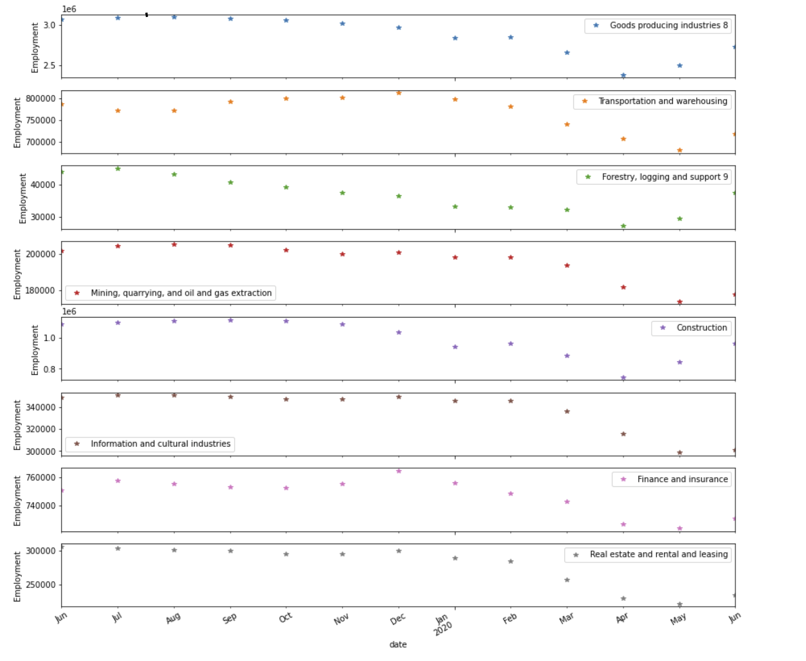

# The Employment and the Pandemic

*How covid19 has affected employment in Canada across different industries*

Data:
------

Statistics Canada. Table 14-10-0201-01 Employment by industry, monthly, unadjusted for seasonality
https://www150.statcan.gc.ca/t1/tbl1/en/tv.action?pid=1410020101
DOI: https://doi.org/10.25318/1410020101-eng

Results:
--------

In Canda, as the year 2020 was starting, news of the pandemic started to hit home but people were still not aware of its impact on their livelihood. But the numbers show that employment numbers were slowly declining since January with the biggest shock felt in March when the lockdown was announced.

The good news is that we see all industries starting to rebound by June. However, some industries are bouncing much faster than others such as Forestry, Goods-producing industries as well as Construction. The least improvement is seen understandably in the Finance sector, Real State, and Transportation. Lagging far behind are the most negatively impacted industries: Mining, oil and gas, and Information and cultural industries.  The recent data released just weeks ago only show the numbers up to June, hopefully, we will see much better data for July and August once the data released.

